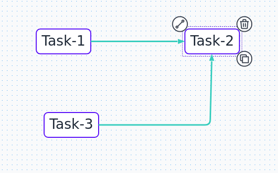
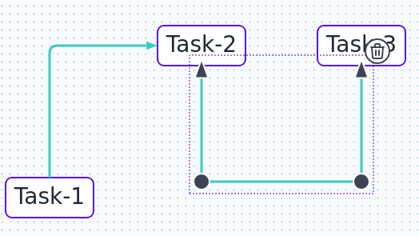
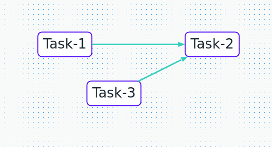

# X-Diagram

A PaperJS based diagram library.

### Screenshot



### GIF



### Example
```typescript
import { XEdgeDef, XDiagram } from "x-diagram";
import { XBoardPlugin, XCopyPlugin, XDataChangePlugin, XDeletePlugin, XElementPlugin, XInteractionPlugin, XLinkerPlugin, XSelectionPlugin } from "x-diagram/plugins";
import {XArrow, XNodeComponent} from "x-diagram/components";
import {XLightTheme} from "x-diagram/themes";
import {PaperRenderer} from "x-diagram/renderers";

document.body.style.width = '100%'
document.body.style.height = '400px'

const xDiagram: XDiagram = new XDiagram(document.body, {
    id: 'test',
    theme: XLightTheme,
    renderer: PaperRenderer,
    catalog: [
        XNodeComponent({ name: 'rounded-node', strokeWidth: 2, padding: 24, radius: 8 })
    ],
    edges: [],
    nodes: [],
    plugins: [
        XElementPlugin,
        XBoardPlugin,
        XSelectionPlugin,
        XLinkerPlugin(XArrow),
        XInteractionPlugin,
        XDeletePlugin,
        XCopyPlugin,
        XDataChangePlugin()
    ]
});

xDiagram.getHookListener().action('x-on-data-change', data => {
    console.log(data)
});
xDiagram.getHookListener().filter('x-arrow-config-mapper', (cfg: XEdgeDef) => {
    cfg.targetPointer = true;
    return cfg;
});


xDiagram.addNode({
    id: 0,
    type: 'rounded-node',
    position: {
        x: 100,
        y: 100,
    },
    text: 'Task-1'
});

xDiagram.addNode({
    id: 1,
    type: 'rounded-node',
    text: 'Task-2',
    position: {
        x: 400,
        y: 100,
    }
});

xDiagram.addNode({
    id: 2,
    type: 'rounded-node',
    text: 'Task-3',
    position: {
        x: 200,
        y: 200,
    }
});

xDiagram.addEdge(0, 1);
xDiagram.addEdge(2, 1);
```